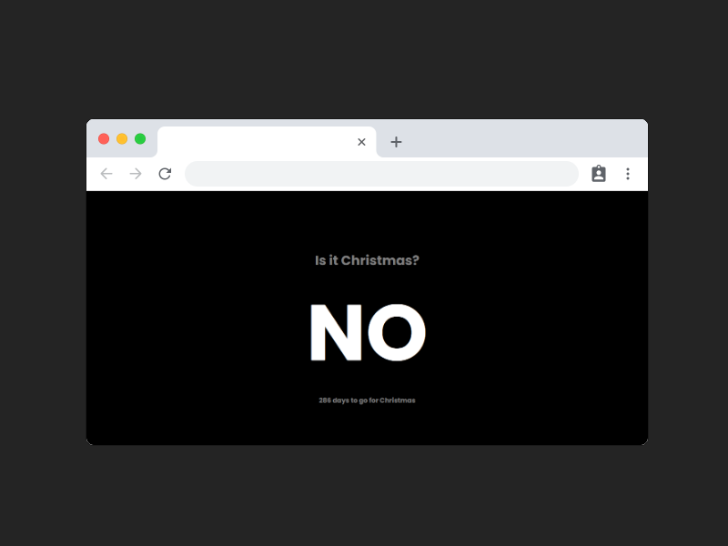

# Is it Christmas?

## Overview
* A simple web application that tells you in one word (YES/NO) whether it's Christmas day or not.
* Build using plain HTML, SASS and vanilla JavaScript.
* Mobile responsive.
* Current date obtained using the Date object in JavaScript.

## Preview

## Important links
* [GitHub Repo](https://github.com/pexeixv/christmas)
* [Live Website](http://pexeixv.github.io/christmas)
